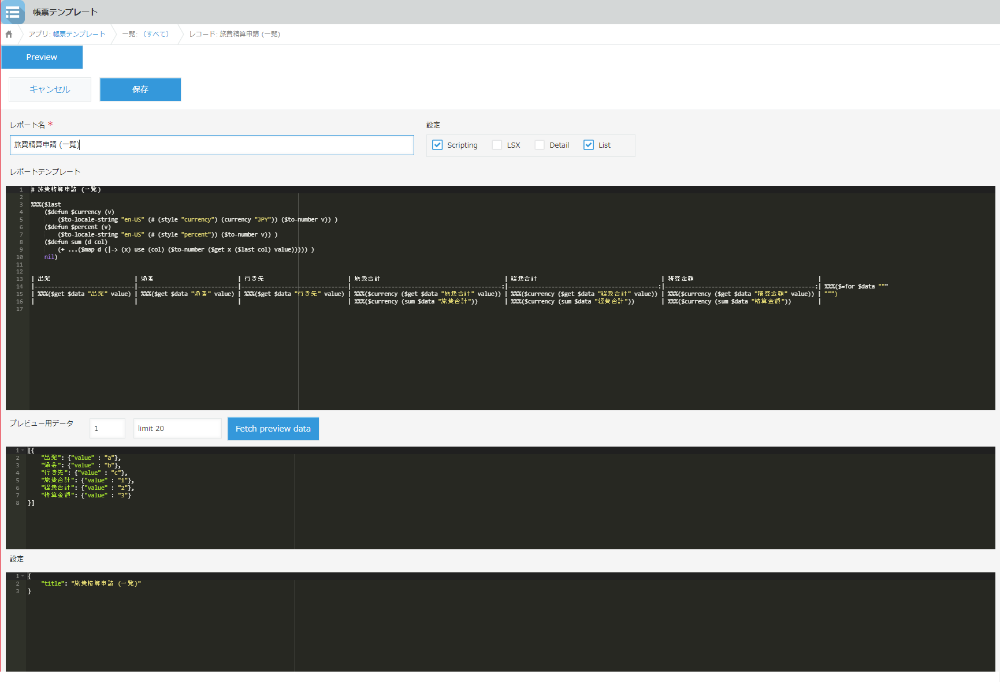
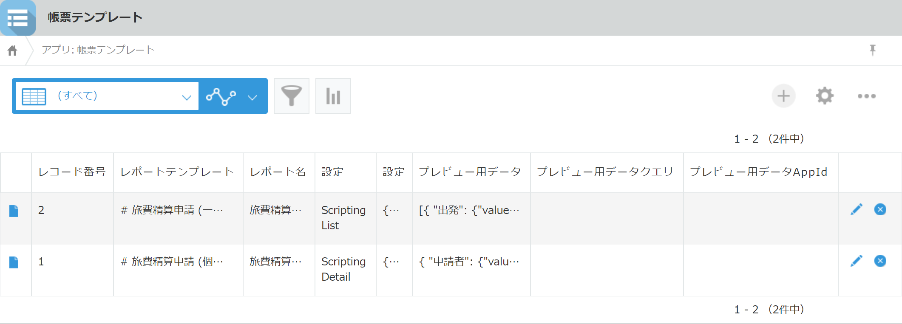
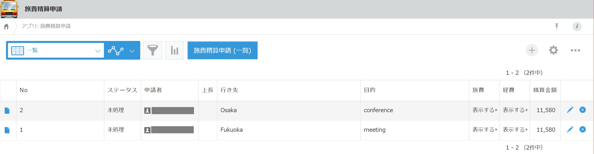
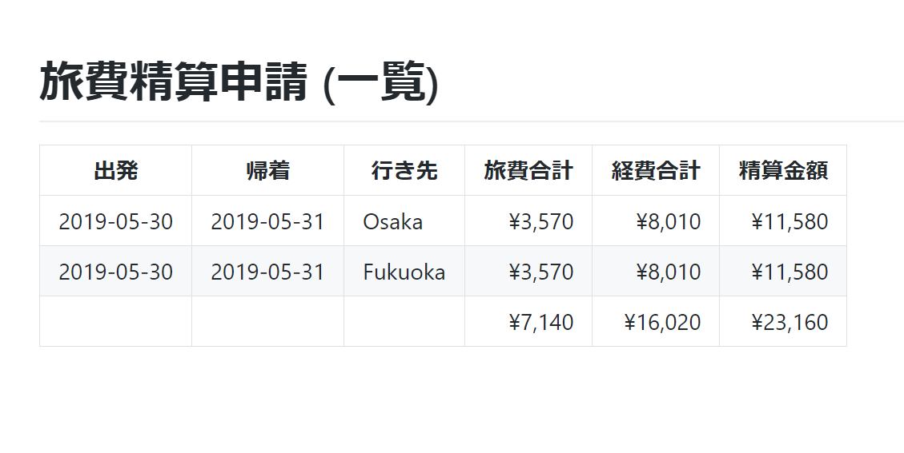
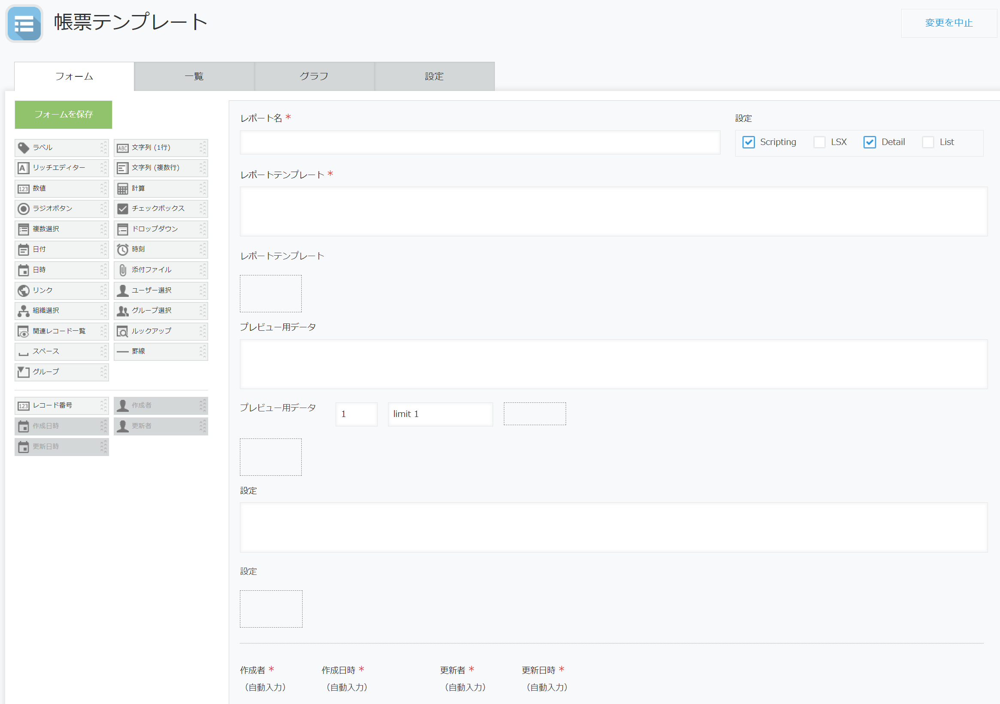

# 📑 Ménneu Reporting App for kintone 📊

Create ✨beautiful✨ 📑📊reports📈📰 easily with [Ménneu](https://www.npmjs.com/package/menneu) + kintone.

You can easily build the complex documents written in Markdown,
HTML and [LSX](https://github.com/shellyln/liyad#what-is-lsx) that including
🖼images, 📊charts, 🔷UML diagrams, barcodes and 2d codes (QR Code).


# 📢 tl;dr
* You can build the **reporting app** by setting your **kintone** environment following the instructions below.
* We do not provide the **app template** ZIP files.
* Report definition can be written in Markdown or [LSX](https://github.com/shellyln/liyad#what-is-lsx).
  * LSX is JSX alternative notation written in Lisp.


# 📍 Features
* Report definition written in Markdown or [LSX](https://github.com/shellyln/liyad#what-is-lsx)
* Report preview on design time
  * Fetching data for preview from the other apps.
* QR code and barcodes (See [Ménneu Playground](https://shellyln.github.io/menneu/playground.html) > `Demo (Markdown)`)
* UML diagrams (Plant UML) (See [Ménneu Playground](https://shellyln.github.io/menneu/playground.html) > `Demo (Markdown)`)
* Charts (Chart.js) (See [Ménneu Playground](https://shellyln.github.io/menneu/playground.html) > `Table and chart (Markdown)`)


# 💎 Example
* [Kanban board](https://github.com/shellyln/kanban-board-for-kintone)


# 🖼 Gallery
## Reporting App - Edit view
Edit a report definition

## Reporting App - List view

## Example App - List view

## Example App - Report (definition is written in markdown)



# 💻 Requiments
* kintone (>=Professional:en / >=Standard:jp)
* browser
  * Google Chrome: latest
  * Firefox: latest


# ⚙️ Setup

## 📑📊 ReportingApp (帳票テンプレート App)

Create a report definition that written in Markdown or [LSX](https://github.com/shellyln/liyad#what-is-lsx) with [Ace](https://ace.c9.io/) editor.  
You can create a report definition while viewing the preview.

### JS and CSS
#### JS (PC, Mobile)
* https://unpkg.com/react@16/umd/react.production.min.js
* https://unpkg.com/react-dom@16/umd/react-dom.production.min.js
* [menneu.min.js](https://shellyln.github.io/releases/menneu/0.1.0/menneu.min.js)
  * **Please do not register the above URL directly. It is not a CDN URL.**
* https://js.kintone.com/ace/v1.4.1/ace.js
* [kintone-ace.js](https://github.com/shellyln/menneu-reporting-app-for-kintone/blob/master/src/reporting-app/kintone-ace.js)
  * **Please do not register the above URL directly. It is not a CDN URL.**
* [report-def-preview.js](https://github.com/shellyln/menneu-reporting-app-for-kintone/blob/master/src/reporting-app/report-def-preview.js)
  * **Please do not register the above URL directly. It is not a CDN URL.**

#### CSS
* [51-modern-default.css](https://github.com/kintone/plugin-examples/blob/master/stylesheet/51-modern-default.css)
  * **Please do not register the above URL directly. It is not a CDN URL.**
* [kintone-ace.css](https://github.com/shellyln/menneu-reporting-app-for-kintone/blob/master/src/reporting-app/kintone-ace.css)
  * **Please do not register the above URL directly. It is not a CDN URL.**


### Fields

|Field Code|Caption|Value|Type|Required|
|----------|-------|-----|----|--------|
|report_name|レポート名||Textbox|X|
|switches|設定|Scripting,LSX,Detail,List,LispData|Checkboxes||
|report_template|レポートテンプレート||Textarea|X|
||レポートテンプレート||Label||
|report_template_ace|||BlankSpace||
|preview_data|プレビュー用データ|[{}]|Textarea||
||プレビュー用データ||Label||
|preview_data_appid|プレビュー用データAppId|1|Textbox||
|preview_data_query|プレビュー用データクエリ|limit 1|Textbox||
|preview_data_btns|||BlankSpace||
|preview_data_ace|||BlankSpace||
|configs|設定|{"title":"example"}|Textarea||
||設定||Label||
|configs_ace|||BlankSpace||
|作成者|作成者||creator|X|
|作成日時|作成日時||createdDt|X|
|更新者|更新者||modifier|X|
|更新日時|更新日時||updatedDt|X|

#### `Switches` description

|Value|Description|
|-----|-----------|
|Scripting|Enable lisp LSX block expansion in markdown `report_template`|
|LSX|`report_template` format is lisp LSX (otherwise format is markdown)|
|Detail|Report is enabled in detail view of the app|
|List|Report is enabled in list view of the app|
|LispData|`preview_data` format is lisp (otherwise format is json)|



### Example report definitions

Create the following records:

#### Report for list view (for multiple records)

##### Report_name
* 旅費精算申請 (一覧)

##### Switches
* Scripting, List

##### Report_template (markdown + lisp LSX scripting)

```markdown
# 旅費精算申請 (一覧)

%%%($last
    ($defun $currency (v)
        ($to-locale-string "en-US" (# (style "currency") (currency "JPY")) ($to-number v)) )
    ($defun $percent (v)
        ($to-locale-string "en-US" (# (style "percent")) ($to-number v)) )
    ($defun sum (d col)
        (+ ...($map d (|-> (x) use (col) ($to-number ($get x ($last col) value))))) )
    nil)


| 出発                         | 帰着                         | 行き先                         | 旅費合計                                     | 経費合計                                     | 精算金額                                     |
|------------------------------|------------------------------|--------------------------------|---------------------------------------------:|---------------------------------------------:|---------------------------------------------:| %%%($=for $data """
| %%%($get $data "出発" value) | %%%($get $data "帰着" value) | %%%($get $data "行き先" value) | %%%($currency ($get $data "旅費合計" value)) | %%%($currency ($get $data "経費合計" value)) | %%%($currency ($get $data "精算金額" value)) | """)
|                              |                              |                                | %%%($currency (sum $data "旅費合計"))        | %%%($currency (sum $data "経費合計"))        | %%%($currency (sum $data "精算金額"))        |

```

##### Preview_data

```json
[{
    "出発": {"value" : "a"},
    "帰着": {"value" : "b"},
    "行き先": {"value" : "c"},
    "旅費合計": {"value" : "1"},
    "経費合計": {"value" : "2"},
    "精算金額": {"value" : "3"}
}]
```

##### Configs

```json
{
    "title": "旅費精算申請 (一覧)"
}
```

#### Report for detail view (for single record)

##### Report_name
* 旅費精算申請 (個別)

##### Switches
* Scripting, Detail

##### Report_template (markdown + lisp LSX scripting)

```markdown
# 旅費精算申請 (個別)

%%%($last
    ($defun $currency (v)
        ($to-locale-string "en-US" (# (style "currency") (currency "JPY")) ($to-number v)) )
    ($defun $percent (v)
        ($to-locale-string "en-US" (# (style "percent")) ($to-number v)) )
    ($defun sum (d col)
        (+ ...($map d (|-> (x) use (col) ($to-number ($get x ($last col) value))))) )
    nil)


## 申請者： %%%($get $data "申請者" value 0 code) %%%($get $data "申請者" value 0 name)


| 出発                         | 帰着                         | 行き先                         | 旅費合計                                     | 経費合計                                     | 精算金額                                     |
|------------------------------|------------------------------|--------------------------------|---------------------------------------------:|---------------------------------------------:|---------------------------------------------:|
| %%%($get $data "出発" value) | %%%($get $data "帰着" value) | %%%($get $data "行き先" value) | %%%($currency ($get $data "旅費合計" value)) | %%%($currency ($get $data "経費合計" value)) | %%%($currency ($get $data "精算金額" value)) |

```

##### Preview_data

```json
{
    "申請者": {"value" : [{"code" : "x", "name" : "y"}] },
    "出発": {"value" : "a"},
    "帰着": {"value" : "b"},
    "行き先": {"value" : "c"},
    "旅費合計": {"value" : "1"},
    "経費合計": {"value" : "2"},
    "精算金額": {"value" : "3"}
}
```

##### Configs

```json
{
    "title": "旅費精算申請 (個別)"
}
```


#### Full LSX Report for list view (for multiple records)

##### Report_name
* LSX example

##### Switches
* Scripting, LSX, List

##### Report_template (lisp LSX scripting)

```lisp
(Html5
    (head (title "LSX Example")
          (meta (@ (charset "UTF-8")))
          (NormalizeCss)
          (PaperCss)
    
        (style (@ (dangerouslySetInnerHTML """$concat

            /* You can write additional styles here. */
            /*
            body {
                background-color: blue;
            }
            */

        """) )) )

    (body (@ (class "A4"))
        ($=for $data
            ;; paper size element
            (section (@ (class "sheet padding-10mm"))
                ::$data:出発:value ","
                ::$data:帰着:value ","
                ::$data:行き先:value ","
                ::$data:旅費合計:value ","
                ::$data:経費合計:value ","
                ::$data:精算金額:value
                ))))
```

##### Preview_data

```json
[{
    "出発": {"value" : "a"},
    "帰着": {"value" : "b"},
    "行き先": {"value" : "c"},
    "旅費合計": {"value" : "1"},
    "経費合計": {"value" : "2"},
    "精算金額": {"value" : "3"}
}]
```

##### Configs

```json

```


#### Embedded report

##### Report_name
* Embedded example

##### Switches
* Scripting, LSX, Detail, List

##### Report_template (lisp LSX scripting)

```lisp
(Markdown """
# Hello
""")
```
##### Preview_data

```json
[{}]
```

##### Configs

```json

```

------------------------


## 🔶 App that uses the ReportingApp

Customize the following application example.  
https://kintone-sol.cybozu.co.jp/apps/073-ryohi.html (🚃 旅費精算申請 App; Travel Expense Reimbursement App)

### JS and CSS
#### JS (PC)
* https://unpkg.com/react@16/umd/react.production.min.js
* https://unpkg.com/react-dom@16/umd/react-dom.production.min.js
* [menneu.min.js](https://shellyln.github.io/releases/menneu/0.1.0/menneu.min.js)
  * **Please do not register the above URL directly. It is not a CDN URL.**
* [app-buttons.js](https://github.com/shellyln/menneu-reporting-app-for-kintone/blob/master/src/user-app/app-buttons.js)
  * **Please do not register the above URL directly. It is not a CDN URL.**
  * Please edit this file to show the button of the defined report.
    * `eXnhAMYWrBVFMczJ__REPORT_APP_ID`: ReportingApp's app id.
    * `eXnhAMYWrBVFMczJ__REPORT_BUTTONS`: Report definition record ids you want to use in this app.
* [kintone-report-buttons.js](https://github.com/shellyln/menneu-reporting-app-for-kintone/blob/master/src/user-app/kintone-report-buttons.js)
  * **Please do not register the above URL directly. It is not a CDN URL.**


`app-buttons.js`
```js
/// Please change following constant values ///
window.eXnhAMYWrBVFMczJ__REPORT_APP_ID = 2; // ReportingApp app id
window.eXnhAMYWrBVFMczJ__REPORT_BUTTONS = [ // iterate the ReportingApp record IDs to be displayed in this app.
    { id: 1 }, { id: 2 }, { id: 3 },
    { id: 5, embed: true },                 // embedded report: display to list and/or detail view.
];
///////////////////////////////////////////////
```

#### CSS
* [51-modern-default.css](https://github.com/kintone/plugin-examples/blob/master/stylesheet/51-modern-default.css)
  * **Please do not register the above URL directly. It is not a CDN URL.**


------------------------


# ⚖️ License

* MIT (except `kintone-ace.js`, `kintone-ace.css`)

Copyright (c) 2019 Shellyl_N
